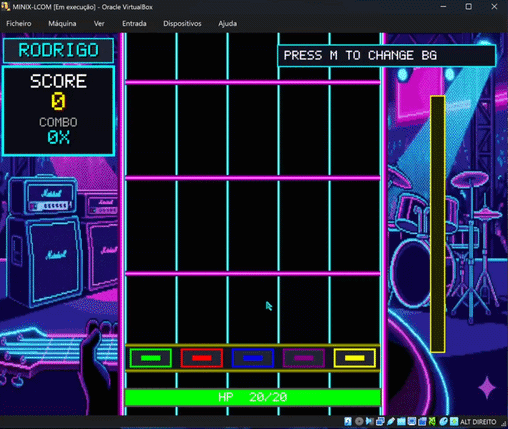

# Guitar Hero LCOM

Projeto de LCOM inspirado em Guitar Hero, com vídeo em modo gráfico, teclado, rato, timer, RTC, UART para áudio externo e leaderboard persistente.

## Demo

<p align="center">
  
</p>


## Como compilar

```bash
cd Project
make
lcom_run proj
```

Durante o `make`, os beatmaps em `Project/beatmaps` são copiados para `/tmp/beatmaps`, o que torna o carregamento das músicas menos dependente do caminho absoluto usado na VM.

## Controlos

- Rato: navegar nos menus.
- A, S, D, F, G: acertar nas cinco pistas.
- ESC: sair. Se estiveres numa run, o score atual é guardado antes de fechar.

## Funcionalidades principais

- Menu principal e seleção de música.
- Carregamento dinâmico de beatmaps.
- Sistema de score e combo.
- Feedback visual para hits e misses.
- Comunicação UART com o script Python de áudio.
- Leaderboard Top 5 guardada em `scores.txt`, com fallback para `/tmp/guitar_hero_scores.txt`.

## Áudio

Ver `Project/SETUP_AUDIO.md` para configurar o par de portas série virtuais e executar `audio_subsystem/som_guitar_hero.py`.